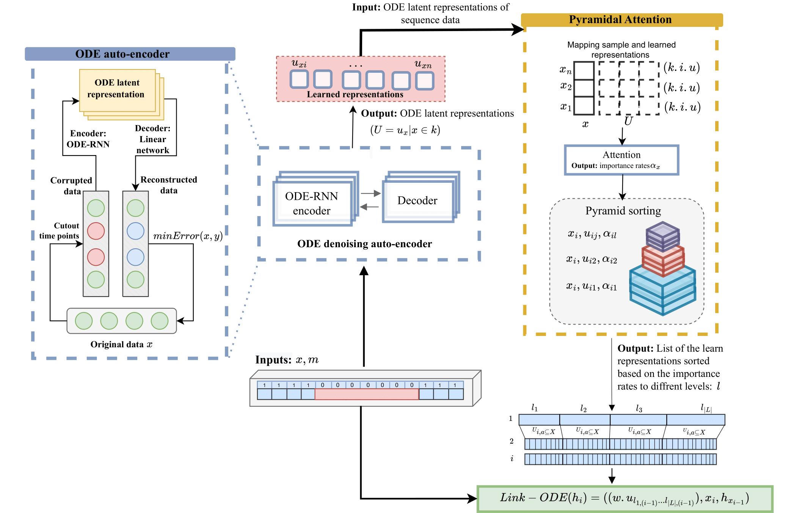

# SeqLink: A Robust Neural-ODE Architecture for Modelling Partially Observed Time Series


This repository contains the code for our enhanced Neural-ODE Architecture. The code is written in PyTorch and follows the methodology described in our paper available on [OpenReview\SeqLink](https://openreview.net/forum?id=WCUT6leXKf).


## Model Overview



We build our code on the publicly available code for ODE-RNN at [Yulia Rubanova's GitHub](https://github.com/YuliaRubanova/latent_ode) For the baselines (RNN-VAE, Latent ODE, and ODE-RNN) we follow the implementation available at [Yulia Rubanova's GitHub](https://github.com/YuliaRubanova/latent_ode). For the CDE model, we follow the implementation available at [Patrick Kidger's GitHub](https://github.com/patrick-kidger/NeuralCDE). For TSMixer we follow the implementation available at [ditschuk's GitHub](https://github.com/ditschuk/pytorch-tsmixer).

## Datasets
All datasets used are in the Dataset folder. Including original data and the .pt format to be used for the ODE-RNN model

The learn representation generated using ODE-RNN is saved in `DataRep/` fplder. 
To regenerate the we recommend you follwoing the instructions of the original code repository

Tha attention and payramid module codes are in scr. 


to generate the final prediction 
Run SeqLink.py


## Repository Structure

- `src/`: Contains the source code for the model, attention mechanism, and pyramid sorting.
- `data/`: Example data files used for training and testing.
- `notebooks/`: Jupyter notebooks demonstrate the use of the model and visualize results.
- `docs/`: Documentation and additional resources.

## Installation

To install the required dependencies, run:

```bash
pip install -r requirements.txt


